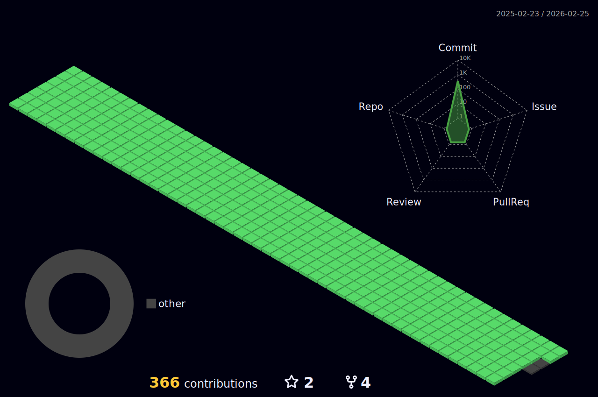

<!--  -->
  
<!-- ## 💻 CODING RECORD 💻
//

   // 
  
 

 -->
  

<h3>📚 Tech Stack 📚</h3>

✨ Platforms & Languages ✨

 

  
  
   
   
   
   

   

   

 
 
 

	
🛠 Tools 🛠

  
 
  

 

 
 

 
 

	
🎨 SNS & Portfolio 🎨

    
  

 
 

 

 

